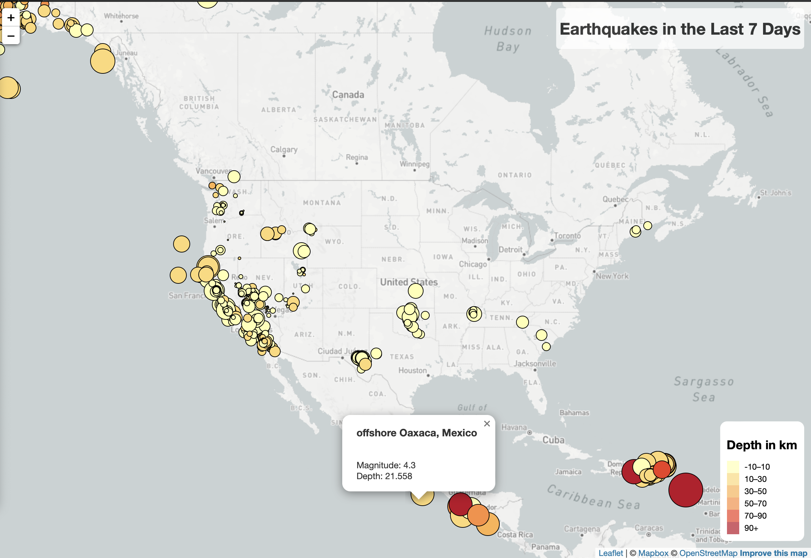

# leaflet-challenge
## Overview of Project

### Instructions

* Map (60 points)
    * TileLayer loads without error (20 points)
    * Connects to geojson API using D3 without error (20 points)
    * Markers with size corresponding to earthquake magnitude (10 points)
    * A legend showing the depth and their corresponding color (10 points)
* Data Points (40 points)
    * Data points scale with magnitude level (10 points)
    * Data points colors change with depth level (10 points)
    * Each point has a tooltip with the Magnitude, the location and depth (10 points)
    * All data points load in the correct locations (10 points)

### Purpose

I am utilizing javascript, html and leaflet to analyze data from a dataset in order to get more detailed information about what the data shows.

## Analysis and Challenges

### Analysis of Outcomes Based on Goals

* During this assignment I was able to complete all the goals and objectives for the assignment. I used what I have learned in the class to trouble shoot the code as I went through with javascript and made sure I was fully understanding what each part of my code did through labeling, so when an error popped up I knew how to approach the problem.

### Challenges and Difficulties Encountered

* I think the biggest challenge for me was figuring out how to remember how to use the API geomapping system within the html site.

### HTML page

